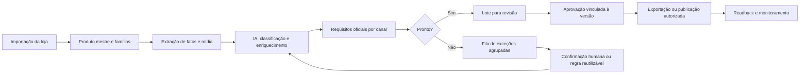

# PRD — Adaptação da Central de Preparação

**Produto:** FBR PreListing  
**Status:** proposta para implementação  
**Data:** 08/10/2026  
**Responsáveis:** Operação FBR, Catálogo, Produto e Engenharia

## 1. Resumo

A Central de Preparação será transformada de uma interface orientada a formulários por SKU em uma linha de produção de listings. O sistema deve importar o catálogo, extrair fatos existentes, propor enriquecimentos por IA, aplicar requisitos oficiais de cada marketplace e encaminhar pessoas somente para exceções que não podem ser resolvidas com segurança.

O resultado esperado é que a equipe trabalhe por impacto: uma decisão sobre material, embalagem, marca ou regra de família deve desbloquear todos os produtos afetados, em vez de exigir preenchimento repetido SKU a SKU.

## 2. Problema

A experiência atual expõe detalhes técnicos antes de organizar o trabalho. Isso cria três efeitos:

- o operador não sabe por onde começar;
- o mesmo dado é solicitado em vários produtos relacionados;
- a IA parece ser apenas um gerador de texto, e não um mecanismo de preparação integral.

O sistema precisa distinguir claramente dados que podem ser extraídos, inferidos, reutilizados, confirmados ou bloqueados por ausência de evidência física/comercial.

## 3. Objetivos

1. Preparar automaticamente o maior volume possível de dados de listing a partir da loja, regras internas e schemas oficiais.
2. Tornar cada pendência humana explícita, pequena, verificável e agrupada por causa raiz.
3. Permitir tratar produto individual, família de variantes ou regra compartilhada conforme o escopo correto.
4. Mostrar prontidão real por canal, sem confundir conteúdo gerado, aprovação, aceitação do marketplace e publicação.
5. Produzir lotes revisáveis e exportáveis com versão, evidência e rastreabilidade.

## 4. Fora de escopo

- Inventar dados físicos, fiscais, certificações, GTINs, custos ou direitos de uso de imagens.
- Publicar listings ou criar anúncios sem versões expressamente autorizadas.
- Tratar confirmação de ingestão como prova de listing publicado ou comprável.
- Resolver operações de fulfillment, pedido, imposto ou logística de cada marketplace.

## 5. Usuários e responsabilidades

| Papel | Responsabilidade principal |
| --- | --- |
| Operador de catálogo | Resolve exceções, confirma fatos e revisa lotes. |
| Revisor | Aprova versões completas e exceções de conteúdo. |
| Administrador | Configura contas, regras globais, fontes e autorizações de publicação. |
| IA | Extrai, classifica, sugere, redige, identifica lacunas e explica sua confiança. |
| Sistema | Aplica schemas, valida regras, agrupa impacto, preserva evidências e impede publicação insegura. |

## 6. Fluxo alvo

## 7. Experiência da nova Central

### 7.1 Visão geral: “o que destrava mais listings?”

A página inicial deve apresentar cartões e listas priorizadas:

- produtos totais, elegíveis, excluídos, prontos para revisão e bloqueados;
- prontidão por Amazon, eBay, Walmart e TikTok;
- principais tipos de bloqueio;
- fatos ou regras que destravam mais SKUs;
- famílias inconsistentes;
- lote de revisão recomendado;
- incidentes operacionais que exigem ação.

Cada número deve abrir uma lista filtrada. Não haverá CTA genérico para “preencher cadastro”.

### 7.2 Fila de exceções

Cada item da fila representa uma decisão, não um formulário completo. Exemplos:

| Exceção | Escopo | Ação humana | Impacto mostrado |
| --- | --- | --- | --- |
| Material não confirmado | Regra/família | Confirmar valor e fonte | “Desbloqueia 84 SKUs” |
| Peso da embalagem ausente | Família | Informar medida e evidência | “Desbloqueia 12 variantes” |
| Categoria ambígua | Produto | Escolher entre candidatos | “Bloqueia Amazon US” |
| GTIN ou isenção ausente | Produto/canal | Informar código ou decisão | “Bloqueia publicação” |
| Imagem principal insuficiente | Produto | Subir ou aprovar mídia | “Bloqueia validação” |

Requisitos de cada exceção:

- motivo legível e regra que a originou;
- canal, SKU/família/regra afetados;
- valor sugerido pela IA, fonte, confiança e justificativa;
- quantidade de produtos desbloqueados;
- formulário mínimo para confirmar, corrigir, rejeitar ou adiar;
- registro de ator, data, evidência e versão.

### 7.3 Produto e família

O detalhe de SKU deixa de ser a tela inicial do fluxo. Ele passa a ser usado para investigar exceções e revisar resultado.

Deve exibir, em ordem:

1. estado de prontidão por canal;
2. fatos confirmados, sugeridos e pendentes;
3. atributos herdados de família ou regra;
4. diferenças específicas da variante;
5. conteúdo de listing gerado;
6. requisitos pendentes e evidências;
7. histórico de mudanças, aprovação e submissão.

O operador deve conseguir promover um fato do SKU para família ou regra somente após ver os produtos que serão afetados.

### 7.4 Revisão em lote

Um lote deve conter somente produtos que passaram pelo motor de prontidão do canal selecionado. A revisão apresenta:

- conteúdo final e atributos relevantes;
- diffs da última versão aprovada;
- evidências e origem dos fatos críticos;
- motivos de exclusão ou bloqueio;
- aprovação individual ou em lote, sem aprovar exceções silenciosamente.

## 8. Motor de preparação integral

Para cada produto, o sistema executará estas etapas de forma idempotente:

1. normalizar produto, SKU, pai, variantes, imagens e fonte;
2. extrair fatos estruturados da fonte disponível;
3. aplicar regras de marca, coleção, família e produto;
4. classificar categoria e tipo de produto por canal;
5. carregar o schema oficial vigente;
6. gerar conteúdo e atributos a partir de fatos confirmados;
7. validar condicionais, mídia, variantes, restrições e oferta;
8. criar exceções somente para o que não pode ser resolvido com evidência;
9. calcular o estado de prontidão e o próximo passo recomendado.

### Estados por campo

Todo campo relevante deverá ter um estado explícito:

| Estado | Significado |
| --- | --- |
| `confirmed` | Confirmado por pessoa, regra aprovada ou fonte confiável. |
| `suggested` | Proposto pela IA, ainda requer confirmação quando crítico. |
| `inherited` | Herdado de família, template ou regra global. |
| `not_found` | Não existe evidência suficiente. |
| `conflicting` | Fontes ou regras divergem. |
| `not_applicable` | Não se aplica à categoria/canal. |

## 9. Requisitos funcionais

### RF-01 — Classificação e enriquecimento automático

O sistema deve classificar todos os produtos elegíveis, sugerir categoria/tipo e preencher automaticamente todos os campos suportados por fatos confirmados ou regras aprovadas.

### RF-02 — Evidência e confiança

Todo valor gerado ou extraído deve informar origem, data, confiança e se exige confirmação humana.

### RF-03 — Regras reutilizáveis

O sistema deve permitir registrar regras em três escopos: global, família e produto. Deve mostrar o impacto antes de aplicar uma regra a múltiplos SKUs.

### RF-04 — Agrupamento de exceções

Exceções equivalentes devem ser agrupadas por campo, canal, regra e conjunto de SKUs afetados. A fila deve priorizar impacto, risco e bloqueio de publicação.

### RF-05 — Requisitos por marketplace

O motor deve comparar a versão corrente do produto com schemas oficiais de Amazon, eBay, Walmart e, quando houver contrato oficial, TikTok. Mudança de schema invalida a prontidão até nova avaliação.

### RF-06 — Prontidão explicável

Para cada canal, o sistema deve informar `draft`, `needs_evidence`, `needs_review`, `ready_for_review`, `approved`, `submitted`, `accepted`, `published`, `not_verified`, `rejected` ou `excluded`, com motivo e próxima ação.

### RF-07 — Revisão e aprovação por versão

Toda aprovação deve estar vinculada ao hash da versão. Alterações em fatos, schema, conteúdo, mídia ou oferta invalidam a aprovação quando pertinentes.

### RF-08 — Publicação controlada

Publicação exige: versão aprovada, canal habilitado, conta correta, autorização explícita e reserva persistente antes de qualquer write externo.

### RF-09 — Aprendizado operacional

Uma correção confirmada deve poder gerar sugestão de regra reutilizável. A aplicação automática dessa regra exige escopo, evidência e aprovação administrativa quando seu impacto for alto.

## 10. Requisitos não funcionais

- Operações em lote idempotentes, recuperáveis e com checkpoint.
- Nenhum segredo em banco de dados, logs, frontend ou exportações.
- Dados de cada organização isolados por RLS e escopo de usuário.
- Explicações e evidências sem expor dados desnecessários.
- Processamento limitado por quota, custo e capacidade do canal.
- Leitura e monitoramento podem ser automatizados; writes externos nunca devem ser repetidos cegamente.
- Tela principal utilizável com catálogo de até 5.000 registros, paginação e filtros.

## 11. Métricas de sucesso

| Métrica | Meta inicial |
| --- | --- |
| Produtos com classificação automática | ≥ 90% dos elegíveis |
| Campos preenchidos sem intervenção por produto | Medir por canal e categoria |
| Exceções resolvidas por regra compartilhada | Crescente a cada ciclo |
| Tempo até `ready_for_review` | Redução por lote comparada ao processo atual |
| Produtos aprovados que retornam com erro de requisito | Tendência a zero |
| Pendências sem dono/próxima ação | Zero |

As metas numéricas finais serão calibradas após o piloto de 20 produtos reais.

## 12. Critérios de aceite

1. Um operador consegue identificar, na tela inicial, a ação que desbloqueia mais produtos.
2. Um fato confirmado em nível de família atualiza a prontidão de todas as variantes afetadas, sem sobrescrever diferenças locais.
3. Produtos completos chegam a revisão sem abertura de formulário campo a campo.
4. Produto incompleto gera exceção específica com motivo, impacto, responsável e ação mínima.
5. Alteração de requisito oficial cria reavaliação e bloqueia exportação/publicação até conclusão.
6. Revisão em lote não aprova produto com bloqueio crítico oculto.
7. Todo listing exportado ou submetido corresponde a uma versão aprovada e rastreável.
8. Nenhuma IA completa como fato um dado físico, regulatório ou comercial sem evidência.

## 13. Migração da Central atual

### Fase 1 — Fundamentos

- Introduzir os estados de campo, exceções agrupadas e cálculo de impacto.
- Manter o editor atual como detalhe técnico e rota de contingência.
- Exibir nova visão geral em modo somente leitura para validação da operação.

### Fase 2 — Operação orientada a exceções

- Habilitar confirmações de fato/regra pela fila.
- Criar revisão por família e lote.
- Medir quantos produtos são resolvidos por cada decisão.

### Fase 3 — Lotes de preparação e revisão

- Gerar lotes por canal e estado de prontidão.
- Mover ações frequentes do editor individual para fluxos em lote.
- Manter links diretos ao SKU para investigação de exceções.

### Fase 4 — Piloto e expansão

- Executar 20 produtos reais representativos.
- Medir precisão, tempo, exceções e problemas de schema.
- Ajustar regras antes de habilitar publicação para mais produtos.

## 14. Dependências e decisões externas

- Usuários, papéis e organização operacional reais.
- Token Amazon válido e contratos de API por marketplace.
- Fatos físicos/comerciais, documentação e mídia dos produtos piloto.
- Definição de cofre de segredos, ambiente de staging, backup e destino de alertas.
- Autorização de SKUs e versões para qualquer publicação real.

## 15. Decisão de produto

O princípio de design da Central será: **o sistema prepara; a pessoa resolve exceções**. Uma tela que pede ao operador todos os campos de todos os produtos é considerada falha de automação, salvo quando esses campos forem fatos desconhecidos, conflitantes ou exigirem responsabilidade humana.
