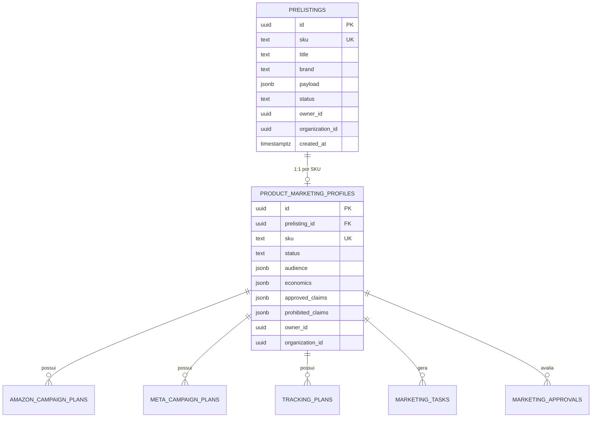

# FBRSigns PreListing + Marketing Readiness

Sistema monólito modular em **Next.js 15 / React 19** desenvolvido para centralizar, estruturar, enriquecer e validar a preparação de produtos da **FBRSigns** para marketplaces internacionais, com foco inicial na **Amazon US**, integrando o fluxo de catálogo ao planejamento e handoff operacional de marketing (**Marketing Readiness**).

---

## 📋 Sumário

- [Visão Geral](#-visão-geral)
- [Principais Funcionalidades](#-principais-funcionalidades)
- [Arquitetura e Tecnologias](#-arquitetura-e-tecnologias)
- [Estrutura do Projeto](#-estrutura-do-projeto)
- [Modelo de Dados (Supabase / Postgres)](#-modelo-de-dados-supabase--postgres)
- [Segurança e Compliance](#-segurança-e-compliance)
- [Fluxo de Aprovação e Handoff](#-fluxo-de-aprovação-e-handoff)
- [Configuração e Instalação](#-configuração-e-instalação)
- [Scripts Disponíveis](#-scripts-disponíveis)
- [Documentação Normativa](#-documentação-normativa)

---

## 🎯 Visão Geral

O **FBRSigns PreListing** atua como a única fonte de verdade para a criação, refinamento e aprovação de produtos físicos destinados à venda online. Ele resolve a dispersão de informações entre especificações técnicas de fábrica, dados de concorrência, copies persuasivas, dados econômicos/margens e estratégias de tráfego.

### Princípios Norteadores:
1. **Fatos Físicos Auditáveis:** Informações de fabricação, materiais e dimensões são dados soberanos e auditados. Referências externas (como concorrentes) servem apenas de inspiração e nunca substituem fatos reais sem aprovação expressa.
2. **Product Preparation + Seller Handoff:** O sistema prepara e valida pacotes completos de submissão e planos de mídia, sem realizar publicações automáticas cegas ou gastos de verba sem intervenção humana.
3. **Isolamento e RLS Multi-tenant:** Toda leitura, criação, edição e arquivamento é isolada por `organization_id` e `owner_id`.
4. **Governança de IA:** Geração assistida de copies e atributos com whitelist estrita de fatos permitidos, validação de provenance e status de `review_required`.

---

## 🚀 Principais Funcionalidades

### 1. Catálogo e PreListing Core
- **Extração Segura de Referências:** Módulo de ingestão de páginas públicas com proteção ativa contra SSRF (bloqueio de IPs locais/privados, validação DNS e limites de streaming).
- **Enriquecimento Assistido por IA:** Geração de títulos, bullet points, descrições e atributos focados nas diretrizes da Amazon US (com OpenAI GPT).
- **Gestão de SKU e Atributos Físicos:** Registro de dimensões, peso, embalagem, compliance, certificações e mídias.
- **Exportação Auditável:** Geração de pacotes em JSON, Markdown e formatos para Amazon Seller Central.

### 2. Marketing Readiness
- **Perfis de Marketing (`Product Marketing Profile`):** Definição por SKU de público-alvo, personas, motivações de compra, objeções, claims aprovados e claims expressamente proibidos.
- **Economia e Margem Real:** Registro de custos de produção, taxas estimadas, frete e margem real calculada (com data de cálculo).
- **Amazon PPC Campaign Plans:** Estruturação de campanhas Sponsored Products, Sponsored Brands, clusters de palavras-chave e estruturas de lances.
- **Meta Ads Plans:** Planejamento de criativos, ângulos de anúncios e orçamentos, associados à Business Manager/Ad Account dedicada de cada produto, com destino inicial validado para a página da Amazon.
- **Tracking & Attribution:** Planejamento de regras de UTMs, tracking de cliques de saída e suporte a Amazon Attribution quando elegível.

### 3. Workflow de Aprovação e Quality Gate
- **Status Auditáveis:** Máquina de estados formal (`draft`, `review_required`, `approved`, `changes_requested`, `rejected`).
- **Gate de Lançamento (`launch_ready`):** Bloqueio estrito de transição para lançamento sem decisão formal `approved` vigente.
- **Handoff para Kanban da FBR Agency:** Criação controlada e idempotente de tarefas no board de execução operacional.

---

## 🛠️ Arquitetura e Tecnologias

- **Framework:** [Next.js 15](https://nextjs.org/) (App Router, Route Handlers no runtime Node.js)
- **Interface:** [React 19](https://react.dev/), [Tailwind CSS 4](https://tailwindcss.com/)
- **Linguagem:** [TypeScript 5](https://www.typescriptlang.org/)
- **Banco de Dados & Auth:** [Supabase](https://supabase.com/) / PostgreSQL com Row Level Security (RLS)
- **Extração & Scraping:** [Cheerio](https://cheerio.js.org/) com validação de rede customizada
- **IA / LLM:** [OpenAI SDK](https://github.com/openai/openai-node)
- **Testes Unitários & Integração:** [Vitest](https://vitest.dev/)

---

## 📁 Estrutura do Projeto

```text
PreListing/
├── app/
│   ├── api/                             # Route Handlers (APIs REST seguras)
│   │   ├── amazon-campaigns/            # Planos de campanha Amazon PPC
│   │   ├── extract/                     # Ingestão segura de URLs (anti-SSRF)
│   │   ├── generate/                    # Geração completa de listing por IA
│   │   ├── generate-field/              # Geração pontual de campo assistida
│   │   ├── kanban/                      # Handoff de tarefas para FBR Agency
│   │   ├── listings/                    # CRUD de PreListings no catálogo
│   │   ├── marketing-approvals/         # Registro de aprovações de marketing
│   │   ├── marketing-profiles/          # CRUD de perfis de marketing por SKU
│   │   ├── meta-campaigns/              # Planos de campanha Meta Ads
│   │   ├── seller-handoff/              # Dados de handoff para Seller Central
│   │   ├── seller-submission/           # Submissões auditadas de catálogo
│   │   └── tracking-plans/              # Planos de UTMs e Amazon Attribution
│   ├── dashboard/                       # Painel administrativo e listagem de produtos
│   ├── marketing/                       # Painel de Marketing Readiness
│   │   ├── page.tsx                     # Visão geral de prontidão por SKU
│   │   └── [sku]/                       # Detalhes, planos PPC, Meta e tracking do SKU
│   ├── layout.tsx                       # Layout raiz da aplicação
│   └── page.tsx                         # Landing/Workspace de criação de listings
├── lib/
│   ├── ai/                              # Contratos de IA, prompts e sanitização
│   ├── auth.ts                          # Adaptador de autenticação (trusted-gateway / local-only)
│   ├── catalog/                         # Regras de catálogo e persistência
│   ├── e2e/                             # Fixtures e mocks para testes E2E
│   ├── extract-security.ts              # Validação de DNS, anti-SSRF e streaming seguro
│   └── marketing/                       # Contratos, guardas de aprovação e validações
├── public/                              # Ativos estáticos
├── supabase-closing-migration.sql       # Migração SQL com validação de integridade e RLS
├── supabase-marketing-schema.sql        # Tabelas do módulo de marketing
├── supabase-schema.sql                  # Tabela base de prelistings
├── tests/                               # Bateria de testes de domínio, segurança e regressão
├── MP-000-foundation.md                 # Mini PRD: Fundação e arquitetura
├── MP-001-marketing-readiness.md        # Mini PRD: Módulo de Marketing Readiness
├── PRD-002-fechamento-fbr-prelisting.md # PRD de auditoria e critérios de fechamento
├── SPRINTS.md                           # Backlog detalhado de Sprints (S0 a S3)
└── STATUS.md                            # Relatório do estado atual de QA e bloqueios
```

---

## 🗄️ Modelo de Dados (Supabase / Postgres)

O banco de dados é estruturado com chave estrangeira lógica e relacional via `sku` e `prelisting_id`:



---

## 🔒 Segurança e Compliance

1. **Modos de Autenticação (`lib/auth.ts`):**
   - `trusted-gateway` *(Padrão em produção/staging)*: Validação de assinatura HMAC nos cabeçalhos HTTP recebidos de um gateway autenticado.
   - `local-only` *(Apenas desenvolvimento)*: Identidade mock fixa para testes locais sem credenciais externas expostas.
2. **Proteção Anti-SSRF (`lib/extract-security.ts`):**
   - Resolução de DNS prévia com bloqueio de endereços IPv4 e IPv6 privados/locais (Loopback, Link-Local, RFC 1918, Carrier-Grade NAT, IPv4-mapped IPv6).
   - `AbortSignal.timeout` e leitura em streaming limitada a 2 MB por padrão (`EXTRACTION_MAX_BYTES`).
3. **Isolamento de Dados (RLS):**
   - Todas as tabelas contêm `organization_id` e `owner_id`.
   - APIs de leitura e escrita filtram ativamente pelo contexto do usuário logado e rejeitam requisições com SKUs arquivados ou pertencentes a outras organizações.

---

## 🚦 Fluxo de Aprovação e Handoff

```text
[ PreListing Criado ]
         │
         ▼
[ Extração & Enriquecimento por IA ]
         │
         ▼
[ Definição do Perfil de Marketing ]
  ├── Economia & Margem Real
  ├── Planos Amazon PPC & Meta Ads
  └── Regras de UTMs & Tracking
         │
         ▼
[ Revisão de Marketing & Quality Gate ]
  ├── ❌ Changes Requested / Rejected ──► Retorna para ajuste
  └── ✅ Approved
         │
         ▼
[ Gate "launch_ready" Liberado ]
         │
         ▼
[ Handoff para Kanban / Seller Central ]
```

---

## ⚙️ Configuração e Instalação

### Pré-requisitos
- **Node.js**: versão 20.x ou superior
- **npm**: versão 10.x ou superior

### Passo a Passo

1. **Clone o repositório:**
   ```bash
   git clone <URL_DO_REPOSITORIO>
   cd PreListing
   ```

2. **Instale as dependências:**
   ```bash
   npm install
   ```

3. **Configure as variáveis de ambiente:**
   Copie o modelo de ambiente:
   ```bash
   cp .env.template .env
   ```

   Edite o arquivo `.env` com as configurações do seu ambiente:
   ```env
   # Modo de autenticação para desenvolvimento local
   PRELISTING_AUTH_MODE=local-only
   PRELISTING_ALLOW_LOCAL_ONLY=true
   PRELISTING_LOCAL_USER_ID=e2e-user
   PRELISTING_LOCAL_ORG_ID=e2e-org

   # Supabase (necessário para persistência remota)
   NEXT_PUBLIC_SUPABASE_URL=https://SEU_PROJETO.supabase.co
   NEXT_PUBLIC_SUPABASE_ANON_KEY=sua-anon-key
   SUPABASE_SERVICE_ROLE_KEY=sua-service-role-key

   # OpenAI (opcional para geração com IA)
   OPENAI_API_KEY=sua-api-key

   # Aplicação
   NEXT_PUBLIC_APP_URL=http://localhost:3000
   EXTRACTION_MAX_BYTES=2000000
   ```

4. **Inicie o servidor de desenvolvimento:**
   ```bash
   npm run dev
   ```
   Acesse a aplicação em [http://localhost:3000](http://localhost:3000).

---

## 📜 Scripts Disponíveis

| Comando | Descrição |
|---|---|
| `npm run dev` | Inicia o servidor de desenvolvimento Next.js na porta padrão |
| `npm run build` | Compila o projeto para produção |
| `npm run start` | Executa a build de produção localmente |
| `npm test` | Executa a suíte de testes automatizados com Vitest |
| `npm run typecheck` | Executa a verificação de tipagem com TypeScript (`tsc --noEmit`) |
| `npm run lint` | Executa a análise estática com Next.js ESLint |

---

## 📚 Documentação Normativa

Para consultar o histórico de decisões, status de auditoria e especificações detalhadas:

- 📄 [`STATUS.md`](./STATUS.md): Estado atual de QA, evidências técnicas e bloqueadores.
- 📄 [`SPRINTS.md`](./SPRINTS.md): Detalhamento das Sprints de entrega (S0 a S3).
- 📄 [`MP-000-foundation.md`](./MP-000-foundation.md): Mini PRD de Fundação da Arquitetura.
- 📄 [`MP-001-marketing-readiness.md`](./MP-001-marketing-readiness.md): Mini PRD de Marketing Readiness.
- 📄 [`PRD-002-fechamento-fbr-prelisting.md`](./PRD-002-fechamento-fbr-prelisting.md): Auditoria e critérios de fechamento do projeto.
